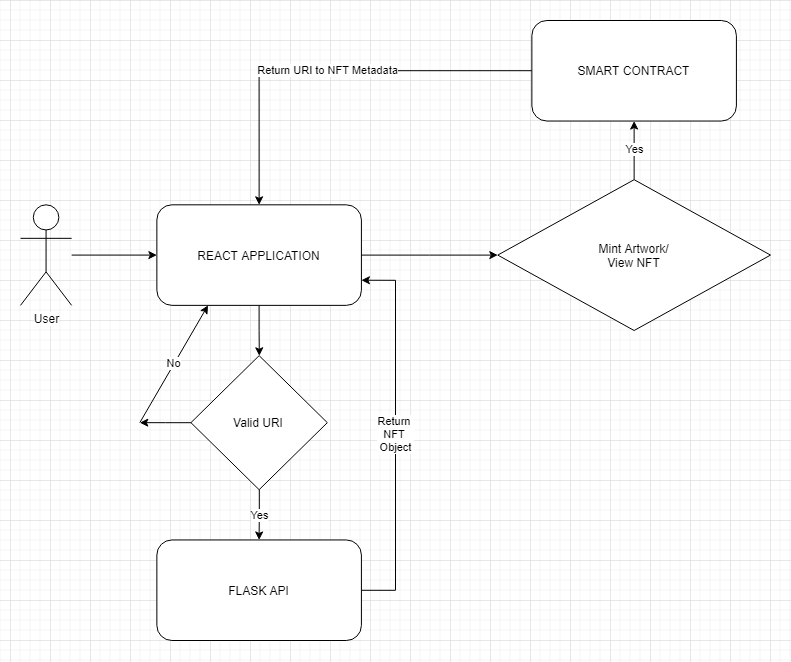

# Startup Hero Creator

## Description

An application that allows the admin to create artwork of a software engineer
that can then be minted as an NFT. NFTs can be viewed on the Collection
page, where they can be selected for merging into a single NFT.

If NFTs are merged, their attributes are combined, but their Name, Description and
Image will be randomly selected. They will also gain points toward their Success attribute.

## Architecture



The general concept for how this NFT application works, is as follows:

1. The Front End is responsible for creating the Artwork to be Minted as an NFT in the Smart Contract

2. The Smart Contract Mints and assigns a TokenId and a URI to the JSON metadata hosted in the FLASK API

3. To view the NFT in the Front End, a request is made to the Smart Contract to verify if the connected User
   has any NFTs assigned to their wallet address.

4. If the User has any, the URI to the JSON Metadata for the NFT is returned to the Front End.

5. The JSON Metadata is then requested from the FLASK API and, if successful, the image and related
   information are returned as an Object.

## Installing Dependencies

There are 3 items that will need dependencies installed:

1. Smart Contract

2. React Application

3. Flask Application

For the **Smart Contract**, install the required dependencies by running the
following in the **'root' directory**:

```bash
# install packages
npm install
```

For the **React Application**, in the **'client' directory**, run the same command:

```bash
# install packages
npm install
```

For the Flask Application, in the **'nft_server' directory**, run the following:

```bash
# setup virtual environment
py -m virtualenv .

# start it up
source ./Scripts/activate

# install dependencies
pip install Flask flask-cors requests python-dotenv

# create sqllite database
# rename empty.nfts.sqlite to nfts.sqlite
py db_nft.py

# run app
py app.py
```

## Running the Application

This is my process for running things, if there's a better way, I'm open to learning more. I'm a general noob
in the blockchain space and always looking to improve.

Once all the dependencies have been installed, the following commands will be all
that's necessary going forward to run this system.

Priority #1, have a nice cup of coffee by your side, then time to get things started.

### Ganache

Start up **Ganache** and then open a Terminal.

In the root directory of the project, run the following to
deploy the smart contract to Ganache.

```bash
# Deploy the smart contract to Ganache
npm run ganache
```

### Flask API Service

Start up the Flask API aka the NFT Storage Facility.

In the **nft_server** directory, run the following to
get the NFT Storage Facility running on localhost:5000

```bash
# start the Flask App
# setup virtual environment
py -m virtualenv .

# activate virtual environment
source ./Scripts/activate

# run the app
flask run
```

### React Application

Let's get the front end of the project running.

In the **client** directory, run the following to
get the Startup Hero Creator React application running
on localhost:3000

```bash
# start up React app
npm run start
```

## If All Goes Well

you should see the following:

1. The first account in Ganache will have a little less than 100 ether in their account
2. On http://localhost:5000, you should see a white page with a grey box containing the text: NFT Storage Facility
3. On http://localhost:3000, you see a React app running called Startup Hero.

The app is dependent on having Web3 available to connect to a Wallet. If Web3 is not available, you
will see a Loading section running in place of where the Startup Hero Creator is located.

At this point, I would open Metamask and import the first account in Ganache.
Right now, only an Admin can Mint artwork.

To explore the database, I use [DB Browser for SQLite](https://sqlitebrowser.org/). Open the nfts.sqlite
file and you should be able to browse the contents and verify the success of any POST requests made
from the React application.

Thanks
